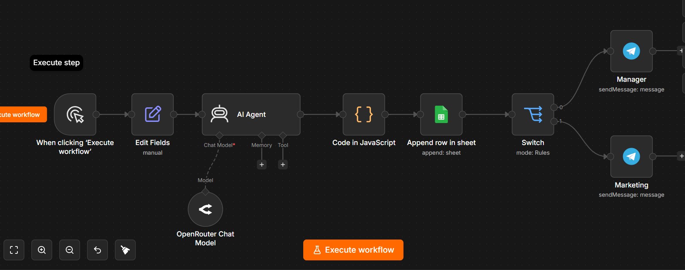
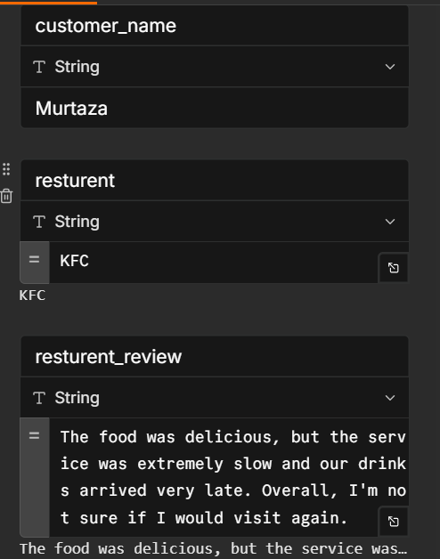
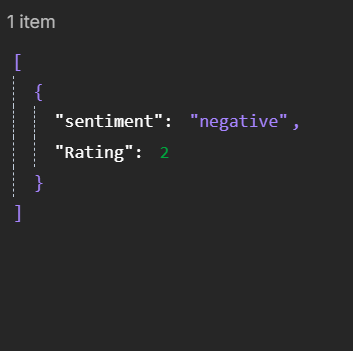
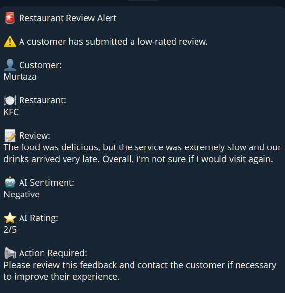

# 🤖 AI Customer Review Analyzer

## 📌 Overview

The AI Customer Review Analyzer is an AI-powered automation workflow built with **n8n**. It automatically analyzes customer reviews, determines customer sentiment, assigns a review score and priority, stores the results in Google Sheets, and notifies the team through Telegram when important reviews require attention.

This workflow helps businesses process customer feedback automatically instead of manually reading every review.

---

## 🚀 Features

* Analyze customer reviews using AI
* Detect customer sentiment and emotion
* Generate an AI review score
* Classify review priority
* Store analyzed results in Google Sheets
* Send Telegram notifications for important reviews
* Automate customer feedback processing

---

## 🛠️ Tech Stack

* n8n
* Google Gemini AI
* Google Sheets
* Telegram Bot API
* JavaScript (Code Node)

---

## 📸 Workflow



---

## 📥 Sample Input



---

## 🤖 AI Analysis



---

## 📱 Telegram Notification



---

## 📈 Business Value

Businesses receive hundreds of customer reviews every day. Reading each review manually is slow and inefficient.

This workflow automatically identifies customer sentiment, highlights important reviews, stores structured data for reporting, and instantly notifies the support team when urgent attention is needed. This reduces manual work, improves response time, and helps businesses make better decisions based on customer feedback.

---

## 🔄 Workflow Process

```text
Customer Review
        ↓
AI Analysis
        ↓
Parse AI Response
        ↓
Store Results in Google Sheets
        ↓
Priority Check
        ↓
Telegram Notification
```

---

## 👨‍💻 Author

**Muhammad Murtaza**

BS Data Science Student | AI Automation | Python | SQL | n8n


